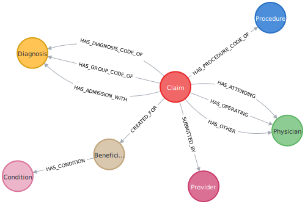
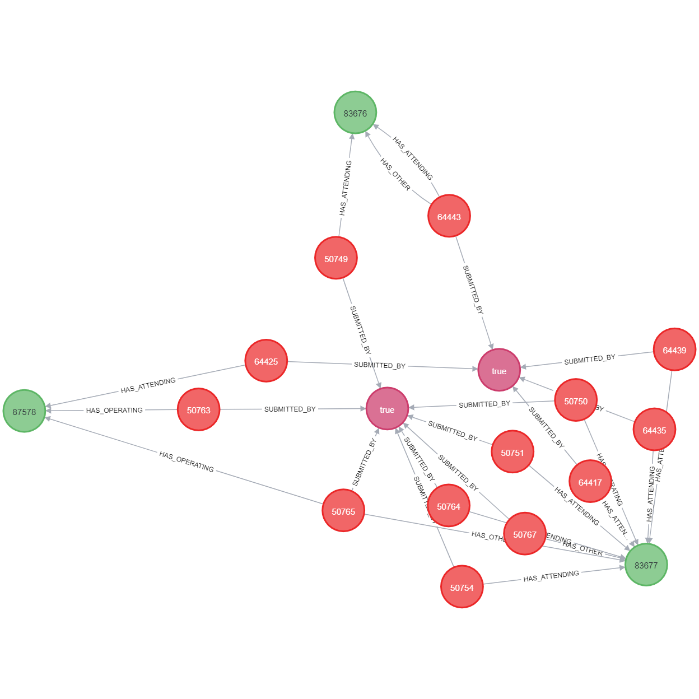
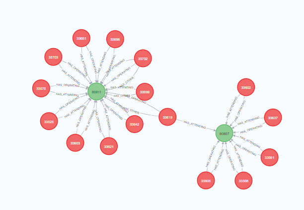

# **ATP – EY Hackathon**

## **Introduction to Neo4j and Cypher through the Insurance (Fraud) Claims Graph Database**

This document contains the exercises that the participants will have to solve during the hackathon. The idea is to introduce the participant to Cypher and the possibilities of Graph Databases (GD) through a series of exercises.

The exercises start out simple and increase in difficulty and complexity. Additionally, there is a seperate notebook that will introduce some graph algorithms, then working in teams implement graph algorithms and add them as potential features to a machine learning model.
<!--
The exercises are split into 3 levels. Each level is more demanding than the previous as it touches upon more advanced concepts.
The structure is the following:

***Level 1 : Basics of Cypher and GD***

* aggregation
* extrema
* connection logic  
 Some of the things that can be easily done in SQL as well.

***Level 2 : Advantages of GDs***

* 1st degree connections
* 2nd degree connections or more
* shortest or longer paths between nodes  
  These are things can be done in SQL but the complexity increases dramatically in comparison to Cypher.

***Level 3 : Algorithms in Graph Databases***   
These exercises will be hosted in another notebook which will be provided seperately.
-->
---

### **Tasks**

First we will start with some basic stuff that you just need to run in Cypher that help you get a better understanding of the dataset and the databases.
These are simple Tasks where you just need to copy-paste the code in the Sandbox, run it and just see the results.

### **Exercises**

The idea is that, each new step will start with a small example that introduces you to some new syntax and logic in Cypher. At the same time we will try to explore different aspects of the dataset while we are getting acquainted with the new syntax.  

After having understood the example you can move on to the exercise that folows that example. There you will be asked to extract the results that the question is requiring. The exercise will most of the times require to extract some additional value from the example or to reuse the code to extract a diffirent result with the same concept.  

Once we have learned some cool Cypher tricks, there will be a series of small exercises that would resemble some small Data Analysis steps.

<br>

<details>
  <summary> Answers and Help to the execises (Click to expand) </summary>

The answers to the exercises will also be provided in similar drop down buttons.

It's always a good idea to take a look at the answer to see if you did it right... However you may have another solution.

</details>

<br>

 # **Tasks**

<br/>

**1. Task : Visualize the database structure.**

```
 call db.schema.visualization() 
 ```

With this command you can see the nodes and connections in a graph database. It is a very useful command for understanding the schema of the database.

You should get the following output.


<br/>

**2. Task : Return the properties for a certain node type.**

```
MATCH (c:Claim) RETURN properties (c)
limit 1
```
This way you match a variable `c` to all the nodes of type `(:Claim)` and return the properties of those nodes.

You shoud get something like the following if you click the table output format.

```json
{
  "reimbursedAmt": 26000,
  "claimEndAfterDischarged": 0,
  "admissionDate": "2009-04-12",
  "daysClaimLasted": 7,
  "endDate": "2009-04-18",
  "dischargeDate": "2009-04-18",
  "deductibleAmt": 1068.0,
  "id": "CLM46614",
  "startDate": "2009-04-12",
  "daysAdmitted": 7
}
```


Try to run this query to see the properties of the Beneficiary nodes.

<br/>

**3. Task : Return all the node labels (i.e. different categories) and the number of distinct nodes in each label.**


```
match (n) return labels(n) as node_labels, count(*) as number_of_nodes
 ```
You should be seeing the following:


```
╒═══════════════╤═════════════════╕
│"node_labels"  │"number_of_nodes"│
╞═══════════════╪═════════════════╡
│["Condition"]  │12               │
├───────────────┼─────────────────┤
│["Beneficiary"]│31289            │
├───────────────┼─────────────────┤
│["Provider"]   │2092             │
├───────────────┼─────────────────┤
│["Claim"]      │40474            │
├───────────────┼─────────────────┤
│["Diagnosis"]  │5538             │
├───────────────┼─────────────────┤
│["Procedure"]  │1326             │
├───────────────┼─────────────────┤
│["Physician"]  │18256            │
└───────────────┴─────────────────┘
```
This result gives us the number of distinct nodes for each node label. 

 # **Exercises**

<br>

## **1. Example : Find the top 5 states with the most beneficiaries.**

```
match (b:Beneficiary) 
return  b.state as state_code, count(*) as amount_of_beneficiaries 
order by amount_of_beneficiaries desc 
limit 5
 ```

 ```
╒════════════╤═════════════════════════╕
│"state_code"│"amount_of_beneficiaries"│
╞════════════╪═════════════════════════╡
│5           │2695                     │
├────────────┼─────────────────────────┤
│10          │2345                     │
├────────────┼─────────────────────────┤
│45          │2098                     │
├────────────┼─────────────────────────┤
│33          │2026                     │
├────────────┼─────────────────────────┤
│39          │1400                     │
└────────────┴─────────────────────────┘
```
## **1.1 Exercise : Could you extend the query to include the amount of beneficiaries per gender per state as in the table below?**
```
╒════════════╤════════╤═════════════════════════╕
│"state_code"│"gender"│"amount_of_beneficiaries"│
╞════════════╪════════╪═════════════════════════╡
│5           │2       │1511                     │
├────────────┼────────┼─────────────────────────┤
│10          │2       │1335                     │
├────────────┼────────┼─────────────────────────┤
│45          │2       │1237                     │
├────────────┼────────┼─────────────────────────┤
│5           │1       │1184                     │
├────────────┼────────┼─────────────────────────┤
│33          │2       │1162                     │
└────────────┴────────┴─────────────────────────┘
 ```
<details>
  <summary> Answer to Exercise 1.1 (Click to expand)</summary>

```
match (b:Beneficiary) 
return  b.state as state_code, b.gender, count(*) as amount_of_beneficiaries 
order by amount_of_beneficiaries desc 
limit 5
```
</details>

<br/>

In this exercise we only extracted information from one type of node. Next we will see how we can extract information from two or more nodes.
## **2. Example  : Find the IDs of the top 5 providers with the most claims assigned to them.**

```
match (p:Provider)<--(c:Claim)
return p.id as provider_ID,  count(c) as number_claims
order by number_claims desc
limit 5

 ```
The result should look like the following table:
 ```
╒══════════╤═══════════════╕
│"p.id"    │"number_claims"│
╞══════════╪═══════════════╡
│"PRV52019"│516            │
├──────────┼───────────────┤
│"PRV55462"│386            │
├──────────┼───────────────┤
│"PRV54367"│322            │
├──────────┼───────────────┤
│"PRV53706"│282            │
├──────────┼───────────────┤
│"PRV55209"│275            │
└──────────┴───────────────┘
 ```

 Notice how the relationship between the provider and claim was not necessary to specify in this example. We would have to specify the relation between nodes if we are only interested in a particular way the two nodes are connected. 


## **2.1 Exercise  : Can you extend the query above to include the total reimbursed amount per provider? Find the providers with the highest amount of reimbursed claims.** Tip: Use the sum() function.

 ```
╒═════════════╤═══════════════╤═════════════════════════╕
│"provider_ID"│"number_claims"│"total_reimbursed_amount"│
╞═════════════╪═══════════════╪═════════════════════════╡
│"PRV52019"   │516            │5580870                  │
├─────────────┼───────────────┼─────────────────────────┤
│"PRV55462"   │386            │4260100                  │
├─────────────┼───────────────┼─────────────────────────┤
│"PRV54367"   │322            │3040900                  │
├─────────────┼───────────────┼─────────────────────────┤
│"PRV53706"   │282            │2776000                  │
├─────────────┼───────────────┼─────────────────────────┤
│"PRV55209"   │275            │2756100                  │
└─────────────┴───────────────┴─────────────────────────┘
 ```

 <details>
  <summary> Answer to Exercise 2.1 (Click to expand)</summary>

```
match (p:Provider)<--(c:Claim)
return p.id as provider_ID,  count(c) as number_claims,sum(c.reimbursedAmt) as total_reimbursed_amount
order by number_claims desc
limit 5
```
</details>
<br/>

## **2.2 Exercise : Could a reimbursement amount over 100.000 for a claim be a good flag for fraudulent providers?**
<details>
  <summary> Answer to exercise 2.2(Click to expand)</summary>

```
MATCH (c:Claim)-->(p:Provider)
WHERE c.reimbursedAmt >= 100000
RETURN c.id as claim, c.reimbursedAmt as amount, p.id as provider, p.fraud as fraud
ORDER BY amount DESC
```
When ordering by descending see that most of the claims above 100.000 are associated with fraudulent providers. This could indicate that the reimbursement amount could be a feature for machine learning, but more testing must be done.
</details>

<br>


## **2.3 Exercise : Look into the beneficiary with id BENE134045. How many claims are they associated with? With which providers? How are the Physicians involved? Plot all the first degree connections for this beneficiary and then all the 1st degree connections of those connections.**

Next we will extract information from two related nodes.
<details>
  <summary> Answer to Exercise 2.3 (Click to expand)</summary>

```
MATCH (b:Beneficiary{id:'BENE134045'})-->(cond:Condition)
MATCH (c:Claim)-->(b)
MATCH (c)-[x]->(p:Physician)
MATCH (c)-->(pr:Provider)
RETURN b, p, c, cond, pr,x
LIMIT 100
```
</details>

<br/>
Lets explore the results in graph form a bit.
Expand one or two nodes.  
You can reproduce the same result if you match the beneficiary and then expand all the the nodes connected to them. 


## **3. Exercise : List the top 10 providers with the highest number of claims, the average reimbursement amount per claim and list the fraud flag as well. Order by descending average reimbursement amount per claim.**

One would expect that the providers with the highest average amount per claim are fraudulent. Lets see if that is true.  
The result should look something like this:
```
╒═════════════╤═══════╤══════════════╤═══════════════════════════╕
│"provider_id"│"fraud"│"count_claims"│"average_reimbursed_amount"│
╞═════════════╪═══════╪══════════════╪═══════════════════════════╡
│"PRV51954"   │false  │23            │11826.086956521738         │
└─────────────┴───────┴──────────────┴───────────────────────────┘
```

 <details>
  <summary> Answer to Exercise 3 (Click to expand)</summary>

```
Match (p:Provider) <--(c:Claim)
return p.id as provider_id,p.fraud as fraud, count(distinct c.id) as count_claims,avg(c.reimbursedAmt) as average_reimbursed_amount
order by average_reimbursed_amount desc
limit 10
```
As we can see only one of them is fraudulent.
```
╒══════════╤═════════╤══════════════╤═══════════════════════════╕
│"p.id"    │"p.fraud"│"count_claims"│"average_reimbursed_amount"│
╞══════════╪═════════╪══════════════╪═══════════════════════════╡
│"PRV56664"│false    │1             │57000.0                    │
├──────────┼─────────┼──────────────┼───────────────────────────┤
│"PRV57080"│false    │1             │57000.0                    │
├──────────┼─────────┼──────────────┼───────────────────────────┤
│"PRV57399"│false    │1             │57000.0                    │
├──────────┼─────────┼──────────────┼───────────────────────────┤
│"PRV52537"│false    │1             │57000.0                    │
├──────────┼─────────┼──────────────┼───────────────────────────┤
│"PRV52518"│false    │1             │57000.0                    │
├──────────┼─────────┼──────────────┼───────────────────────────┤
│"PRV51681"│false    │1             │51000.0                    │
├──────────┼─────────┼──────────────┼───────────────────────────┤
│"PRV55675"│false    │2             │40500.0                    │
├──────────┼─────────┼──────────────┼───────────────────────────┤
│"PRV53397"│true     │3             │38666.666666666664         │
├──────────┼─────────┼──────────────┼───────────────────────────┤
│"PRV53033"│false    │2             │37500.0                    │
├──────────┼─────────┼──────────────┼───────────────────────────┤
│"PRV51259"│false    │4             │37500.0                    │
└──────────┴─────────┴──────────────┴───────────────────────────┘
```

</details>
Lets try to reorder the results based on descending count of claims. How does this change the corellation to fraud providers?
<br/>

Next we will introduce specific relationships.

<br/>


## **4. Example : For each type of physician relation, find the total amount of claims and the average reimbursed amount per claim.**

```
match (p:Physician) <-[r]- (c:Claim) 
return type(r) as physician_relationship_type, count(c) as number_claims , avg(c.reimbursedAmt) AS average_reimbursed_amount
order by average_reimbursed_amount desc
 ```
The result should look like the following table:
 ```
╒═════════════════════════════╤═══════════════╤═══════════════════════════╕
│"physician_relationship_type"│"number_claims"│"average_reimbursed_amount"│
╞═════════════════════════════╪═══════════════╪═══════════════════════════╡
│"HAS_OPERATING"              │23830          │12454.2287033152           │
├─────────────────────────────┼───────────────┼───────────────────────────┤
│"HAS_OTHER"                  │4690           │11788.098081023432         │
├─────────────────────────────┼───────────────┼───────────────────────────┤
│"HAS_ATTENDING"              │40362          │10085.940240820582         │
└─────────────────────────────┴───────────────┴───────────────────────────┘
 ```

We can see here that we had to add the relationship as a variable so that we can group by the type of the relationship. 
What we can see from the results is that the operating physician is the highest charging type of physician.  

Quick question: The average reimbursed amount number is not very readable though. Can you figure out from [this list of functions](https://neo4j.com/docs/cypher-cheat-sheet/current/#functions) a nice function to make the number more readable i.e. to not have so many decimals, like in the table below?

<br>
<details>
  <summary> Answer to quick question(Click to expand)</summary>

```
 either the round() or toInteger() functions over avg(c.reimbursedAmt) 
```
There is a lot of math , string and logical functions that can be applied on the node properties.
</details>
<br>
Up to now we have been viewing our results in tabular form much like as with any standard SQL query language. We will now also get acquainted with results in graph form. This way is much more visual, it makes it easier to spot interesting connection and is another benefit of using graph databases.

Lets look at an example:

We want to find the operating physicians that are connected to a claim where the reimbursed amount was between 15.000 and 30.000 

```
match (p:Physician) <-[r:HAS_OPERATING]- (c:Claim) 
where 15000 < c.reimbursedAmt < 30000
return p, r, c
limit 50
 ```

Lets explore the graph result. **The reason why we can now see the graph result option is because we have returned the nodes and not some node attribute value like "c.attribute_example".** 

We can see that some of the results that comprise of only two nodes might also have a relationship where the physician is also attending instead of just operating. Cypher displays more information that might exist between nodes that  satisfy the initial constraints i.e. (Physician) <-[OPERATING]- (Claim). 

There are also chains of nodes longer than 2 nodes.  The same principle applies to that as well. The initial population is the pairs of nodes that satisfy the criteria and then Cypher checks if there is any additional information that can be displayed.  


## **4.1 Exercise : Find 5 claims where there was an operating or attending physician, the reimbursed amount was greater than 90.000 and the patient was admitted for less than five days(c.daysAdmitted). Order results by descening reimbursed claim amount.**

The result should look like the following table.
```
╒══════════════╤═════════════════════════╤═══════════════════╤═══════════════╕
│"Physician_id"│"Physicians_relationship"│"Reimbursed_Amount"│"Days_admitted"│
╞══════════════╪═════════════════════════╪═══════════════════╪═══════════════╡
│"PHY401806"   │"HAS_OPERATING"          │102000             │2              │
├──────────────┼─────────────────────────┼───────────────────┼───────────────┤
│"PHY356002"   │"HAS_ATTENDING"          │102000             │2              │
├──────────────┼─────────────────────────┼───────────────────┼───────────────┤
│"PHY379956"   │"HAS_OPERATING"          │101000             │4              │
├──────────────┼─────────────────────────┼───────────────────┼───────────────┤
│"PHY319002"   │"HAS_ATTENDING"          │101000             │4              │
├──────────────┼─────────────────────────┼───────────────────┼───────────────┤
│"PHY430692"   │"HAS_OPERATING"          │94000              │4              │
└──────────────┴─────────────────────────┴───────────────────┴───────────────┘
```
<details>
  <summary> Answer to Exercise 4.1 (Click to expand)</summary>

```
match (p:Physician) <-[r:HAS_OPERATING|HAS_ATTENDING]- (c:Claim)  
where c.reimbursedAmt> 80000 and c.daysAdmitted<5 
return p.id as Physician_id, type(r) as Physicians_relationship, c.reimbursedAmt as Reimbursed_Amount, c.daysAdmitted as Days_admitted
order by Reimbursed_Amount desc
limit 5
```
</details>

<br>


## **5. Example  : Lets explore the connections between physicians, claims and benefiaries. We are going to limit the results to 20.**   


```
match (ph:Physician)<--(c:Claim)-->(b:Beneficiary)
return b,c,ph
limit 20
```
We can see here how we can query 2nd degree relationships. We could easily expand the chain of nodes as much as we want but that is not always very comprehensible. Let's expand then!

## **5.1 Example : Lets find the beneficiaries that have more than one claim with the same physician and limit the total amount to 200.**  
```
match (ph:Physician)<--(c1:Claim)-->(b:Beneficiary)
match (b)<--(c2:Claim)-->(ph)
where  c1.id<>c2.id
return b,ph,c1,c2
limit 200
```
<details>
  <summary> Could also be done this way for example... (Click to expand)</summary>

```
match (ph:Physician)<--(c1:Claim)-->(b:Beneficiary)<--(c2:Claim)-->(ph)
where c1.id<>c2.id
return b,c1,c2,ph
limit 200
```
</details>
<br>

The first match statement here creates our initial population. Then we can carry over the nodes that match our search criteria and use them in a second match statement. The only remaining constraint is that the claims in the two match statements should have different identities in order to get the result we want.
<br>  
Explore the graph result. Does the output make sense?
<br>

## **5.2 Exercise : Find all the physicians that collaborate with more than one provider. Limit the results to 30 nodes.** 

TIP: Use the logic from the example
<details>
  <summary> Help to Exercise 5.2 (Click to expand)</summary>

```
match (ph:Physician)<--(m)--> (p1:Provider)
match {...}<--{...}-->{...}
where {...}<>{...} 
return {...},p1,ph,n,m
limit 30
```
</details>


<details>
  <summary> Answer to Exercise 5.2 (Click to expand)</summary>

```
match (ph:Physician)<--(m)--> (p1:Provider)
match (p2:Provider)<--(n)--> (ph)
where p2.id<>p1.id 
return p2,p1,ph,n,m
limit 30
```


We can see that the physicians that come up happen to be all connected to two providers that are fraudulent. That is not the case for all of them and the following query proves that.
```
match (pr:Provider)<--(c:Claim)-->(p:Physician)
where p.id = 'PHY364363'
return pr, c, p
```

</details>

<br>


Explore the graph! Check out the answer above as well!

Lets expand the idea to physicians and the claims and introduce the  <a href="https://neo4j.com/docs/cypher-cheat-sheet/current/#with" target="_blank">WITH statement</a>. What if there is a physician that had multiple roles in the same claim? That does not sound right... 


## **6. Example : Lets find the physicians that have more than one type of connection to the same claim. Limit the results to 100.**  
The WITH statement can be basically thought of a temporary RESULT statement. In this case, we can use it to find which physicians have more than one relationship to a claim and filter on that aggregation before we even reach the the result statement. 
```
match (p:Physician)<-[rel]-(c:Claim)
with p, c, count(*) as  rel_count, collect(type(rel)) as rel_types
where rel_count >1
return p, rel_count , c, rel_types
limit 100
```
If we run the result we can see some physicians like the following one in the image having mmultiple relationships to many different claims. 



It would be interesting to see if physicians with similar behaviour are connected to fraudulent claims.
<br>


### Quick exercise: From the results of the example above, check whether the physicians that have a multiple connections to claim with more than 1 relationship, are connected to fraudulent providers. Pick 3 physicians you like.

<br>

<details>
  <summary> Answer to quick question (Click to expand)</summary>

```
match (pr:Provider)<--(c:Claim)-[rel]->(p:Physician)
where p.id = 'PHY342205' or p.id = 'PHY402711' or p.id = 'PHY432797' 
return pr, c, p
```
The physicians that I chose were all connected to a fraudulent provider.
</details>

<br>  

## **6.1 Exercise : Find the average claim reimbursement for claims with patients that have cancer.**

The result should approximately be 10403
<details>
  <summary> Answer to Exercise 6.1 (Click to expand)</summary>

```
MATCH (con:Condition {id: 'ChronicCond_Cancer'})<--(b:Beneficiary)<--(c:Claim)
WITH avg(c.reimbursedAmt) as average_reimbursed, max(c.reimbursedAmt) as max_reimbursed, min(c.reimbursedAmt) as min_reimbursed
RETURN average_reimbursed, max_reimbursed, min_reimbursed
```
Here we can also see what the maximum and minimum reimbursement amounts are
</details>

<br/>
Next we will connect two or more nodes together and extract information from more that two nodes.

<br/>


## **6.2 Exercise : It seems like in some claims there is an inconsistency between end date of the claim and the discharge date of the beneficiary. Could you check  how many of these are fraud? Do you see any pattern?**
<details>
  <summary> Answer to exercise 6.2(Click to expand)</summary>

```
MATCH (p:Provider)<--(n:Claim)
WHERE n.endDate <> n.dischargeDate
WITH COUNT(p) AS total_inconsistency
MATCH (p:Provider)<--(n:Claim)
WHERE  n.endDate <> n.dischargeDate AND p.fraud = True
WITH COUNT(*) AS fraud_inconsistency, total_inconsistency
RETURN fraud_inconsistency, total_inconsistency, (fraud_inconsistency*1 / total_inconsistency)*100
```

</details>

<br>

Next we will talk about paths in Cypher. 

## **7. Example : Lets talk paths!** 

A path in Cypher is a variable that holds exactly what the name suggests. A path between two nodes. That can either be a 1st degree connection or a 100th degree connection. Lets see an example: 

```
match path = ((p:Provider) <-- (c:Claim))
return path
limit 5
```

Paths are very valuable in cypher cause they bring out a lot of information that is otherwise almost impossible to access with SQL.
Lets look at another example.
## **7.1 Example : Lets find the shortest path between provider PRV51003 and PRV51023** 

Providers are connected in numerous ways. To find the quickest way from one node to another we can use shortestPath.
Note that we could even provide relationships to consider when looking for the path.

```
match path=shortestPath((p:Provider {id: 'PRV51003'})-[:SUBMITTED_BY|HAS_OPERATING|HAS_ATTENDING|HAS_OTHER|HAS_PROCEDURE_CODE_OF*]-(neighbour:Provider {id: 'PRV51023'}))
return path
```

From the graph we can see that this neighbour is fraudulent.

<br>

## **7.2 Exercise : Calculate the ratio of fraudsters among the providers in the same distance of 4 hops considering the Procedure and Claim nodes only.** 

TIP: You can specify the exact amount of hops to make to find the neighbouring node you are interested in.
<details>
  <summary> Help to Exercise 7.2 (Click to expand)</summary>

```
match (p:Provider)-[*8]-(neighbour:Provider)
```
</details>

<details>
  <summary> Answer to exercise 7.2 (Click to expand)</summary>

```
match (p:Provider {id: 'PRV51003'})
match (p)-[:SUBMITTED_BY|HAS_PROCEDURE_CODE_OF*4]-(neighbours:Provider)
where p.id <> neighbours.id
with p, size(collect(distinct neighbours)) as neighbours_count
match (p)-[:SUBMITTED_BY|HAS_PROCEDURE_CODE_OF*4]-(fraudsters:Provider {fraud:True})
where p.id <> fraudsters.id
with p, size(collect(distinct fraudsters)) as fraud_count, neighbours_count
return p.id, fraud_count*1.0 / neighbours_count as fraudsters_ratio
```

</details>

<!--
# Table of Contents
1. [Example](#example)
2. [Example2](#example2)
3. [Third Example](#third-example)
4. [Fourth Example](#fourth-examplehttpwwwfourthexamplecom)


## Example
## Example2
## Third Example
## [Fourth Example](http://www.fourthexample.com) 
-->